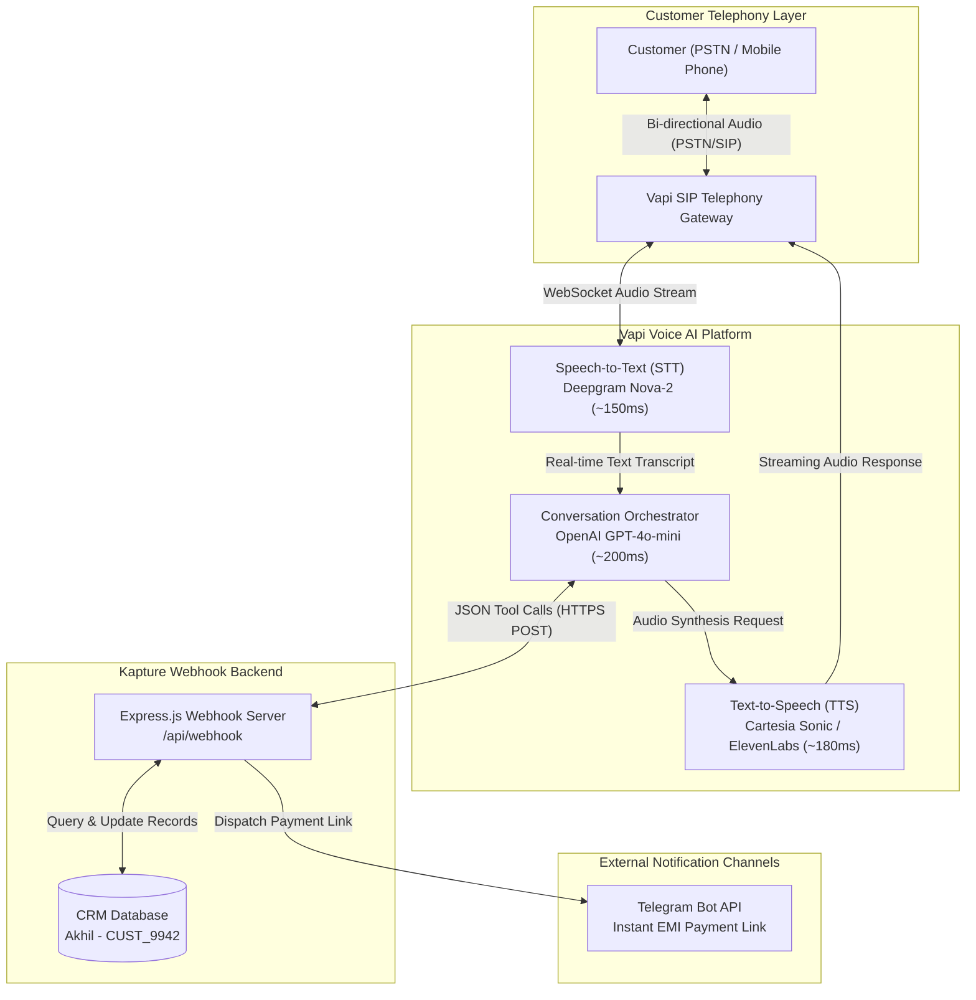
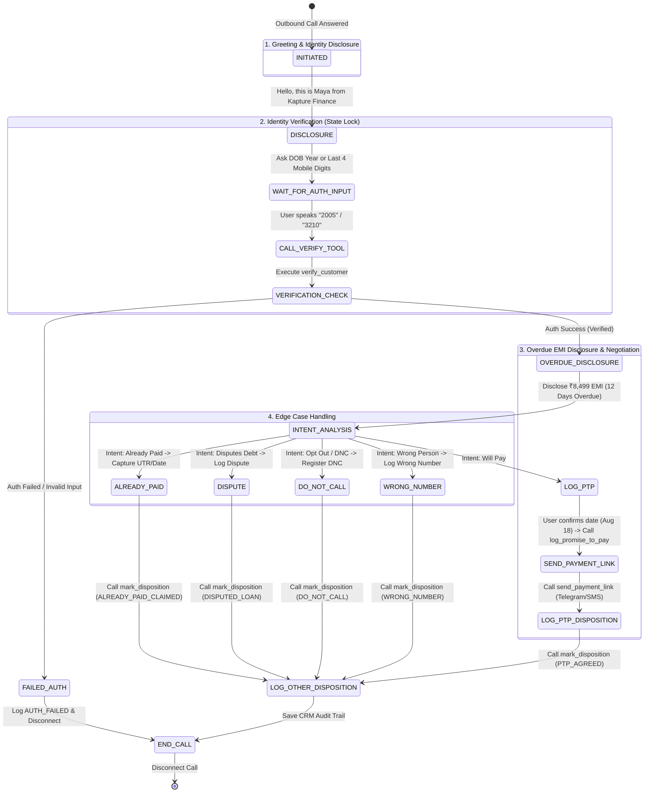

# High-Level Design (HLD): Outbound Collections Voice AI Agent ("Maya")
**Client**: Kapture Finance  
**Author**: AI Delivery Team  
**Date**: August 2026  
**Document Version**: 1.0  

---

## 1. Executive Summary & Problem Statement

Kapture Finance requires an automated outbound Voice AI collections agent ("Maya") to contact borrowers with overdue personal loan EMIs (e.g. customer Akhil, ₹8,499 overdue, 12 days past due). The bot's primary goal is to authenticate customers securely, explain the overdue status, negotiate payment commitments (Promise to Pay - PTP) or send payment links, handle edge cases cleanly, and record disposition metrics—all while strictly adhering to fair-collection compliance guidelines (RBI norms).

---

## 2. Telephony Architecture & Voice Pipeline

The system uses a low-latency voice pipeline integrating SIP telephony, real-time Speech-to-Text (STT), Large Language Model (LLM) orchestration, Text-to-Speech (TTS), and backend API webhooks.



### 2.1 Latency Budget Per Hop

To maintain a natural human conversation flow, the total End-to-End (E2E) latency must remain under **900 ms**:

| Hop Component | Provider / Technology | Target Latency | Optimization Strategy |
| :--- | :--- | :--- | :--- |
| **Telephony & Network** | SIP / Vapi Gateway | 100 ms | Regional SIP trunking (Mumbai / Asia-South) |
| **Speech-to-Text (STT)** | Deepgram Nova-2 | 150 ms | Interim streaming transcripts, endpointing detection |
| **Orchestrator / LLM** | GPT-4o-mini | 200–250 ms | Streaming tokens, low temperature (0.1), constrained tools |
| **Text-to-Speech (TTS)** | Cartesia / ElevenLabs | 180–220 ms | Streaming audio chunks over WebSockets |
| **Webhook Execution** | Express.js / Vercel Serverless | 50–80 ms | In-memory lookup / indexed DB queries |
| **Total Target Latency** | **E2E Pipeline** | **~750 – 850 ms** | **Barge-in / Interruption handling enabled** |

---

## 3. Conversation Flow & State Machine

The voice agent is governed by a **deterministic state machine**. State transitions are locked, meaning the LLM cannot skip authentication or disclose financial debt details until explicit verification is completed.



### State Lock Rules:
- **`INITIATED` $\rightarrow$ `DISCLOSURE`**: Bot introduces itself: *"Hello, I am Maya calling from Kapture Finance. Am I speaking with Mr. Rahul Sharma?"*
- **`IDENTITY_VERIFICATION`**: If person says Yes, ask for verification: *"For security purposes, could you please confirm your Year of Birth or the last 4 digits of your registered mobile number?"*
- **🔒 Debt Disclosure Lock**: Under NO circumstances will the bot mention the ₹8,499 debt or overdue status prior to passing `IDENTITY_VERIFICATION`. If a third party answers (e.g. family member), the bot states: *"Thank you. Please ask Mr. Rahul Sharma to return our call."* and ends the call.

---

## 4. Intents & Entity Extraction Schema

### 4.1 Supported Intents
1. `will_pay`: Customer agrees to pay overdue EMI immediately or on a specific date.
2. `cannot_pay_hardship`: Customer expresses inability to pay due to financial difficulties.
3. `already_paid`: Customer claims payment was made recently.
4. `dispute_amount`: Customer claims amount is incorrect or loan is unauthorized.
5. `wrong_person`: Receiver states they are not Rahul Sharma.
6. `callback_request`: Customer asks to call back later.
7. `hostile_abusive`: Customer uses profanity or threats.
8. `do_not_call`: Customer explicitly requests to stop receiving calls.

### 4.2 Entity Extraction
- `ptp_date` (ISO Date Format: `YYYY-MM-DD`): Promised date of payment.
- `ptp_amount` (Integer): Promised amount to pay.
- `verification_dob_year` (String): E.g., `"1990"`.
- `payment_method` (String): `UPI`, `NetBanking`, `Card`, `Debit`.
- `dispute_reason` (String): Summary of dispute statement.
- `utr_transaction_id` (String): Transaction reference for already paid claims.

---

## 5. Tool & API Specifications

The bot interacts with the backend CRM through 4 core tools via HTTPS Webhook POST calls:

### 5.1 `verify_customer`
- **Purpose**: Authenticates customer against security records before debt disclosure.
- **Request Body**:
  ```json
  {
    "customer_id": "CUST_9942",
    "verification_input": "2005"
  }
  ```
- **Response**:
  ```json
  {
    "verified": true,
    "customer_name": "Rahul Sharma",
    "overdue_amount": 8499,
    "days_overdue": 12,
    "due_date": "2026-08-03"
  }
  ```

### 5.2 `log_promise_to_pay`
- **Purpose**: Records customer's formal promise to pay on a specific date.
- **Request Body**:
  ```json
  {
    "customer_id": "CUST_9942",
    "promised_date": "2026-08-18",
    "promised_amount": 8499,
    "payment_mode": "UPI"
  }
  ```
- **Response**:
  ```json
  {
    "status": "success",
    "ptp_id": "PTP_88310",
    "message": "Promise to Pay recorded successfully."
  }
  ```

### 5.3 `send_payment_link`
- **Purpose**: Triggers SMS/WhatsApp payment link to customer's registered phone.
- **Request Body**:
  ```json
  {
    "customer_id": "CUST_9942",
    "channel": "SMS",
    "amount": 8499
  }
  ```
- **Response**:
  ```json
  {
    "status": "sent",
    "payment_url": "https://pay.kapture.fi/emi/8499",
    "timestamp": "2026-08-15T19:15:00Z"
  }
  ```

### 5.4 `mark_disposition`
- **Purpose**: Logs final call status, containment flag, and notes in CRM database.
- **Request Body**:
  ```json
  {
    "customer_id": "CUST_9942",
    "disposition_code": "PTP_AGREED",
    "call_contained": true,
    "escalated_to_human": false,
    "call_summary": "Customer verified identity, agreed to pay ₹8499 by Aug 18. Payment link sent via SMS."
  }
  ```
- **Response**:
  ```json
  {
    "status": "logged",
    "call_id": "CALL_44102"
  }
  ```

---

## 6. Compliance & Guardrails

1. **Mandatory Identity Disclosure**: Bot must state name ("Maya") and company ("Kapture Finance") in the first utterance.
2. **Third-Party Non-Disclosure**: No mention of "debt", "loan", "EMI", or "overdue" to anyone other than the verified customer.
3. **Calling Window Enforcement**: Outbound calls restricted to **08:00 AM – 07:00 PM IST**.
4. **Non-Harassment & Tone**: Polite, professional, empathetic. Strict prohibition of threats, elevated pitch, or shaming language.
5. **Right to Opt-Out (Do Not Call)**: Immediate compliance if customer says "Stop calling me" or "Put me on Do Not Call list".
6. **Hallucination Prevention**: Temperature set to `0.1`. Bot strictly constrained to provided API tools and factual loan account parameters.

---

## 7. Edge Cases Matrix

| Edge Case | Detection Trigger | Bot Action / Response | State Disposition |
| :--- | :--- | :--- | :--- |
| **Already Paid** | "I already paid yesterday" / UTR provided | Ask for date/reference, call `mark_disposition(ALREADY_PAID_CLAIMED)` | `ALREADY_PAID` |
| **Disputes Debt** | "This is not my loan" / "Amount is wrong" | Express empathy, log dispute details, call `escalate_to_human()` | `ESCALATED_DISPUTE` |
| **Wrong Person** | "No such person lives here" | Apologize politely, mark as wrong number, disconnect immediately | `WRONG_NUMBER` |
| **Language Switch** | Customer speaks Hindi ("Hindi me bolo") | Transition seamlessly to professional Conversational Hindi | `BILINGUAL_HI` |
| **Silent / No Input** | 5 seconds of silence | Prompt: *"Are you still there Mr. Rahul?"* (Disconnect after 2 retries) | `TIMEOUT_NO_RESPONSE` |
| **Abusive Caller** | Profanity / Threat detected | *"Sir, I request you to maintain professional decorum. I am transferring this call to a senior manager."* | `ESCALATED_ABUSIVE` |

---

## 8. Observability & Evaluation Metrics

To evaluate and continuously debug the collections voicebot, the system tracks 5 key operational metrics:

1. **Call Containment Rate (%)**: Percentage of calls resolved by Maya without human agent intervention. Target: **> 75%**.
2. **Promise-to-Pay (PTP) Conversion Rate (%)**: Percentage of verified overdue calls ending in a logged PTP. Target: **> 45%**.
3. **Authentication Pass Rate (%)**: Percentage of callers successfully completing identity verification. Target: **> 85%**.
4. **Average Turn Latency (ms)**: Time elapsed between customer finishing utterance and bot speaking. Target: **< 850 ms**.
5. **Drop-off Rate by State**: Identifies which conversation state experiences the highest disconnects.
