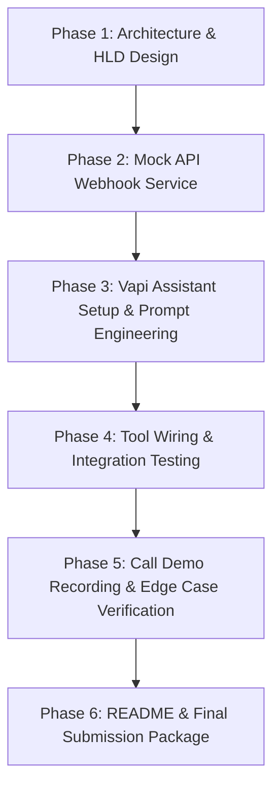

# Implementation Plan: Voice AI Collections Agent ("Maya") - Kapture Finance

## Overview
This plan outlines the end-to-end strategy for designing, building, testing, and documenting an outbound Voice AI Collections Agent ("Maya") for Kapture Finance as specified in the Kapture AI Delivery Intern Take-Home Assignment.

---

## 🎯 Task Breakdown & Key Objectives

### Task 1: High-Level Design (HLD) Document & Architecture
- **Architecture & Telephony Pipeline**: Telephony (Twilio/Vapi SIP) $\rightarrow$ STT (Deepgram/Whisper) $\rightarrow$ Orchestrator / LLM (GPT-4o / Claude 3.5 Sonnet) $\rightarrow$ TTS (ElevenLabs / Cartesia / Deepgram Aura), datastore (PostgreSQL/Redis), and webhook server. Define hop latency budgets (Target total latency: < 800ms - 1200ms).
- **State Machine & Flow Control**: Define deterministic conversation states: `INITIATED`, `DISCLOSURE`, `IDENTITY_VERIFICATION`, `REASON_FOR_CALL`, `NEGOTIATION` (PTP / Dispute / Hardship / Already Paid / DNC), `ACTION` (Trigger Payment Link / Escalation), and `CLOSING_DISPOSITION`. Enforce identity verification state programmatically / deterministically before disclosing any financial debt details.
- **Intents & Entity Extraction**: Map customer intents (`will_pay`, `cannot_pay_hardship`, `dispute_amount`, `already_paid`, `wrong_person`, `callback_request`, `hostile`, `do_not_call`) and extracted entities (`ptp_date`, `ptp_amount`, `verification_dob_or_pin`, `payment_method_pref`).
- **Tool / Function API Specifications**:
  1. `verify_customer(customer_id, dob_or_last4)`
  2. `get_account_details(customer_id)`
  3. `log_promise_to_pay(customer_id, amount, date)`
  4. `send_payment_link(customer_id, channel)`
  5. `escalate_to_human(customer_id, reason)`
  6. `mark_disposition(customer_id, final_state, notes)`
- **Compliance & Fair Collection Norms**: Mandatory self/company disclosure, verification before debt disclosure, permitted calling hours, strict non-harassment guardrails, DNC handling, and off-topic/hallucination boundaries.
- **Edge Case & Exception Matrix**: Handling already paid claims, disputes, DNC requests, wrong person answering, voicemail/silence timeouts, abusive/hostile behavior, and mid-call English/Hindi switching.
- **Observability & Analytics**: Log schemas, containment rate, Promise-to-Pay (PTP) conversion rate, per-hop latency, turn duration, drop-off rate, and LLM hallucination tracking.

---

### Task 2: Vapi Voicebot Implementation & Mock API Webhook
- **Vapi Assistant Setup Recommendation**:
  - **Best Model**: `gpt-4o-mini` (or `groq/llama-3.3-70b-versatile`). *Why*: Ultra-fast latency (~150-200ms TTFT), strict tool/function calling adherence, and practically free ($10 Vapi trial credits cover hundreds of call minutes).
  - **Voice**: Cartesia (`Maya` / `Sonic-English`) or ElevenLabs (`Rachel` / `Sarah`).
  - **STT**: Deepgram Nova-2 (Built-in to Vapi, excellent for Indian accented English & bilingual EN/HI).
- **Mock Webhook Server Recommendation**:
  - **Framework**: **Node.js + Express.js** (Recommended: instant sub-50ms serverless execution on Vercel, zero build configuration).
  - **Development & Deployment Workflow (Hybrid)**:
    - *Phase 1 (Development & Testing)*: Run Express locally with `ngrok` (`ngrok http 3000`) for real-time console logging and instant debugging during live Vapi calls.
    - *Phase 2 (Final Submission)*: Deploy to **Vercel** (`https://<app-name>.vercel.app/api/webhook`) for a permanent, 24/7 active webhook URL for evaluators.
- **Free SMS / Notification Platforms**:
  - **Telegram Bot API / Console Mocking**: Instant delivery to phone via Telegram Bot without SMS registration approval, plus structured JSON responses for Vapi tool calls.
  - **Twilio Trial Account**: Optional real SMS integration to verified test numbers.
- **Auxiliary Tools Needed**:
  1. **ngrok**: HTTPS tunnel for local webhook testing.
  2. **Loom / OBS Studio**: For recording the 2–4 minute video demo of live calls.
  3. **Mermaid.js**: For embedding architecture diagrams directly into markdown/PDF docs.

---

### Task 3: Submission Artifacts & Documentation
1. **`HLD_Document.md`** (converted to PDF/Doc or markdown with Architecture Diagram via Mermaid).
2. **`README.md`**: Complete setup guide, architecture choices, debugging stories, and future improvements.
3. **Tool / Function Schemas**: Clean JSON schema definitions for Vapi tools.
4. **Call Recording Links & System Prompt Copy**.

---

## 🛠️ Step-by-Step Execution Plan

### Phase 1: High-Level Design (HLD)
- Draft `HLD_Document.md` including latency budgets, pipeline architecture, Mermaid flowcharts for state machine, tool definitions, compliance guardrails, and observability metrics.

### Phase 2: Mock Webhook Server Development
- Create a lightweight FastAPI / Express service to handle Vapi tool call payloads.
- Implement `/api/verify-customer`, `/api/log-ptp`, `/api/send-payment-link`, `/api/escalate`, and `/api/disposition`.

### Phase 3: Vapi Assistant Configuration
- Create system prompt enforcing strict verification guardrails.
- Configure Vapi assistant JSON payload with transcribers, voice, model parameters, and custom tools.

### Phase 4: Verification & Testing
- Conduct live call tests on Vapi.
- Test primary path (Rahul Sharma - EMI ₹8,499 - 12 days overdue $\rightarrow$ PTP).
- Test secondary paths (Dispute, Already Paid, Wrong Number, DNC).

### Phase 5: Documentation & Submission Packaging
- Write comprehensive `README.md`.
- Export HLD and visual diagrams.
- Document links to Vapi demo calls and Loom walkthrough.
